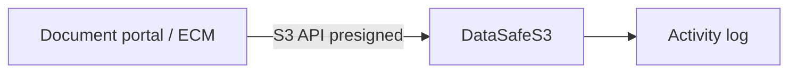

English | **[Русский](../ru/document-storage.md)**

# Private cloud storage

## Problem

Organizations store contracts, scans, and reports and need versioning, access control, and retention policies without sending data to a public SaaS file product.

## Solution

Use DataSafeS3 as a private document repository behind your applications:

1. Buckets per department or shared `documents` bucket with prefixes
2. Enable **versioning** for change history
3. **Object Lock** / legal hold for regulated documents
4. **Presigned URLs** for time-limited external access
5. Review [activity log](../../administrator-guide/en/audit.md) on schedule

## Result

Compliant private document repository with S3 integration, versioning, and full audit trail on your infrastructure.
