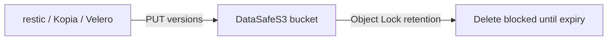

English | **[Русский](../ru/immutable-backup.md)**

# Immutable backup (Object Lock + versioning)

## Problem

Backup tools (restic, Kopia, Velero, Veeam-style S3 targets) need a landing zone where restore points cannot be quietly erased by ransomware or an operator mistake. Object Lock alone or versioning alone is incomplete — both must be configured as one path.

## Solution

Use DataSafeS3 as an **immutable backup** target:

1. Prefer **PostgreSQL** metadata for production ([first run](../../getting-started/en/first-run.md)).
2. Create a dedicated bucket (e.g. `backups-db`).
3. Enable **object versioning** (Console → bucket Settings → Versioning). Use **Suspend** only when you intentionally stop new version IDs while keeping history.
4. Enable **Object Lock (WORM)** and choose retention mode:
   - **Governance** — retention enforced; privileged override possible (ops break-glass).
   - **Compliance** — strict; early delete is blocked for the retention window.
5. Set a default retention period (presets in console).
6. Issue least-privilege S3 access keys for the backup job.
7. Point restic / Kopia / Velero at the S3 endpoint (`:9000` or Caddy path) with those keys.

Partner recipes: [partner cookbook](../../operations-guide/en/partner-cookbook.md). Ops restore of DataSafe itself: [backup & restore](../../operations-guide/en/backup-restore.md).

## Honesty

- **Not WORM** unless Object Lock is enabled on the bucket.
- Versioning without Lock does not stop overwrites of the current key semantics the way Lock + retention does for delete/retention APIs.
- This is **not** 100% AWS Object Lock parity; validate your tool against a lab bucket first.
- After a [MinIO → DataSafe cutover](../../operations-guide/en/migrate-from-minio.md), re-enable versioning and Object Lock on the **target** — source flags are not imported automatically.

## Verify

- Console: Settings show Lock on, mode set, versioning Enabled (not Suspended unless intentional).
- Feature-audit / lab: put object → apply retention → delete returns access denied until expiry.
- Reference smoke: `.\scripts\reference-arch\backup-restore.ps1`

## Architecture

[ADR-0003 Immutable backup golden path](../../architecture/adr/0003-immutable-backup-path.md) (Accepted).
