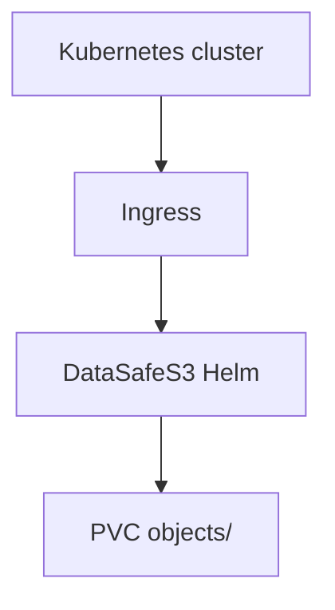

English | **[Русский](../ru/k8s-object-storage.md)**

# Kubernetes object storage

## Problem

Clusters need adjacent S3 storage for Loki, Tempo, Velero, and application uploads under platform team control.

## Solution

Deploy DataSafeS3 with the official Helm chart inside or beside the cluster:

1. `helm install datasafe deploy/helm/datasafe`
2. Ingress for S3 endpoint and console
3. Per-tenant buckets and credentials for workloads
4. Prometheus ServiceMonitor for alerts

See [Helm README](../../../deploy/helm/datasafe/README.md).

## Result

S3 endpoint for cloud-native workloads on infrastructure you operate, with the same governance model as bare-metal deployments.
