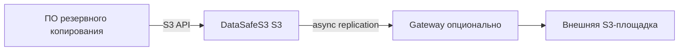

**[English](../en/backup-storage.md)** | Русский

# Репозиторий резервных копий

## Проблема

Инструменты резервного копирования (Veeam, restic, Velero, скрипты) нуждаются в надёжной S3-совместимой цели на контролируемой инфраструктуре.

## Решение

Используйте DataSafeS3 как основную площадку для backup:

1. Production с PostgreSQL ([первый запуск](../../getting-started/ru/first-run.md))
2. Отдельные бакеты на workload
3. S3-ключи с минимальными правами на каждую задачу
4. Опционально: [репликация Gateway](../../administrator-guide/ru/replication.md)
5. [Lifecycle](../../administrator-guide/ru/lifecycle.md) для истечения старых точек

## Результат

Предсказуемая локальная цель backup с опциональными off-site копиями — под вашими политиками retention и доступа.
