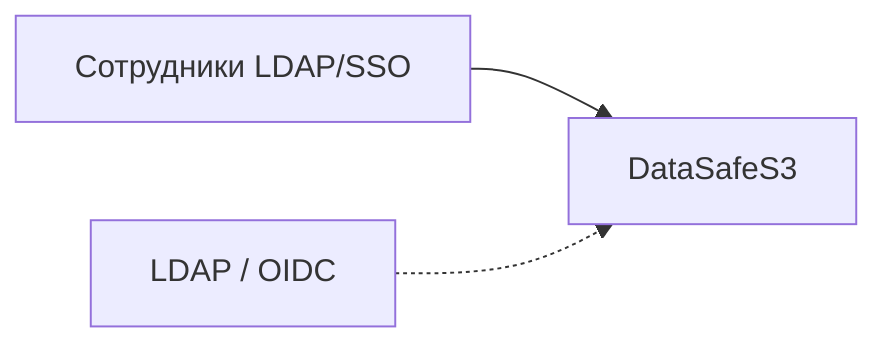

**[English](../en/corporate-file-storage.md)** | Русский

# Корпоративное файловое хранилище

## Проблема

Командам нужно общее хранилище с контролем доступа, SSO и аудитом — при этом данные должны оставаться на инфраструктуре, которой управляет организация.

## Решение

Разверните DataSafeS3 как центральное объектное хранилище и подключите корпоративную идентичность:

- **Тенанты** по подразделениям или бизнес-единицам
- **Группы** для проектных команд и доступа к бакетам
- **Share links** для внешних партнёров (срок + лимит скачиваний)
- **MFA** для администраторов и **журнал активности** для compliance
- **Личное пространство:** при первом входе создаётся домашний бакет (`files` по умолчанию)
- **Обмен в команде:** владелец бакета и tenant admin выдают права чтения/записи коллегам на вкладке **Доступ** в карточке бакета
- **Доступ к папкам:** права на префикс внутри бакета (например, `reports/`) без открытия всего бакета
- **Уведомления:** при шаринге получатель видит оповещение в интерфейсе
- **Недавние:** на странице «Файлы» показываются недавно открытые бакеты и папки
- **Desktop sync (фаза 3):** опциональная синхронизация папки через `datasafe-sync` или Tauri — [clients/README.md](../../../clients/README.md)

Реализация: [LDAP](../../administrator-guide/ru/ldap.md) · [OIDC](../../administrator-guide/ru/oidc.md) · [Тенанты](../../administrator-guide/ru/tenants.md) · [Аудит](../../administrator-guide/ru/audit.md)

## Результат

Централизованное локальное хранилище с корпоративной идентичностью, прозрачностью действий и квотами — данные под контролем организации.
