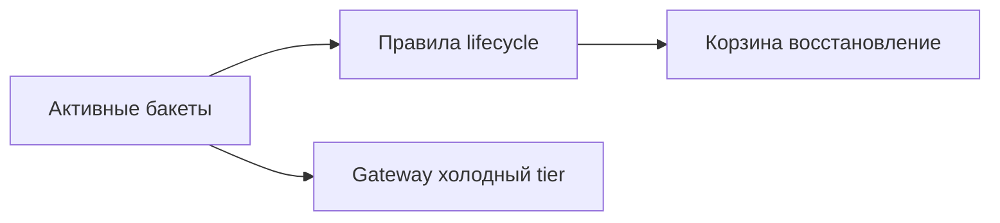

**[English](../en/data-archive.md)** | Русский

# Архив документов и данных

## Проблема

«Холодные» данные нужно хранить годами с контролируемой стоимостью, оставаясь в рамках политик поиска и восстановления.

## Решение

Lifecycle, корзина и опциональная репликация Gateway:

1. [Lifecycle](../../administrator-guide/ru/lifecycle.md) — истечение через N дней
2. **Gateway** — копии архивных бакетов во внешнее холодное хранилище
3. Регулярный [backup](../../operations-guide/ru/backup-restore.md) метаданных
4. Процедура restore в [DR-плане](../../operations-guide/ru/disaster-recovery.md)

## Результат

Многоуровневый архив: быстрый доступ к недавним данным, автоматический retention и опциональные off-site копии.
