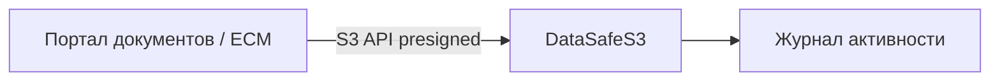

**[English](../en/document-storage.md)** | Русский

# Частное облачное хранилище документов

## Проблема

Организация хранит договоры, сканы и отчёты и нуждается в версионировании, контроле доступа и retention без передачи данных в публичный SaaS.

## Решение

DataSafeS3 как частный репозиторий документов для ваших приложений:

1. Бакеты по подразделениям или общий `documents` с префиксами
2. **Versioning** для истории изменений
3. **Object Lock** / legal hold для регулируемых документов
4. **Presigned URL** для внешнего доступа по времени
5. Регулярный просмотр [аудита](../../administrator-guide/ru/audit.md)

## Результат

Соответствующий требованиям частный репозиторий с S3, версиями и полным audit trail на вашей инфраструктуре.
