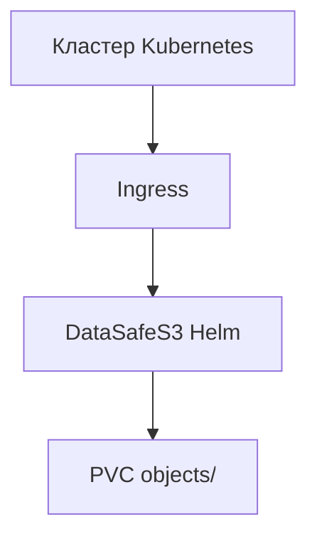

**[English](../en/k8s-object-storage.md)** | Русский

# Объектное хранилище для Kubernetes

## Проблема

Кластерам нужен S3 рядом с workloads для Loki, Tempo, Velero и загрузок приложений под контролем platform-команды.

## Решение

Развёртывание DataSafeS3 через Helm в кластере или рядом:

1. `helm install datasafe deploy/helm/datasafe`
2. Ingress для S3 и консоли
3. Бакеты и credentials по tenant/workload
4. ServiceMonitor Prometheus для алертов

См. [Helm README](../../../deploy/helm/datasafe/README.md).

## Результат

S3 для cloud-native workloads на вашей инфраструктуре с той же моделью governance, что и на bare-metal.
