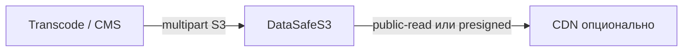

**[English](../en/media-storage.md)** | Русский

# Медиа-репозиторий

## Проблема

Видео, изображения и аудио требуют высокой скорости загрузки, контролируемой публичной раздачи и multipart для больших файлов.

## Решение

DataSafeS3 как S3-backend для transcode/CMS:

1. Бакет `media-assets` — `public-read` или private + presigned
2. Multipart upload для файлов > 5 MB
3. [Квоты](../../administrator-guide/ru/quotas.md) по командам
4. Мониторинг в [Grafana](../../operations-guide/ru/monitoring.md)
5. [Gateway](../../administrator-guide/ru/replication.md) для DR-копий

## Результат

S3-конвейер для медиа с governance, мониторингом и опциональной публичной раздачей.
